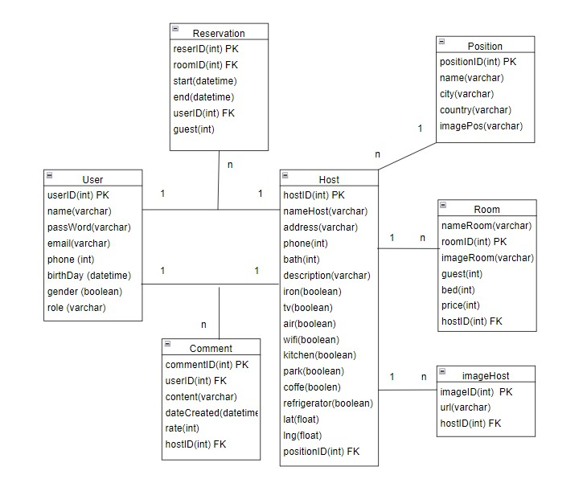

# AirBnb Database project

This is a project programmed by Phong.Thank for watching !

<div align="center">
    
  <p align="center">
    <a href="https://youtu.be/a97b4x7NsnU">View Youte</a><br/>
    <a href="http://165.232.173.144:3000/swagger">View Deploy</a>
  </p>
</div>

<br />

<div align="center">
  
  <a href="./src/assets/full_web.jpeg">Swagger</a>
</div>

## Install

In the project directory, you can run:

```sh
yarn install
yarn start
```

Open [http://localhost:3000/swagger](http://localhost:3000/swagger) to view it in your browser.

## Requests

-   Create a container with Docker then import data from sql folder.
## Framework

-   [NestJS](https://nestjs.com)
